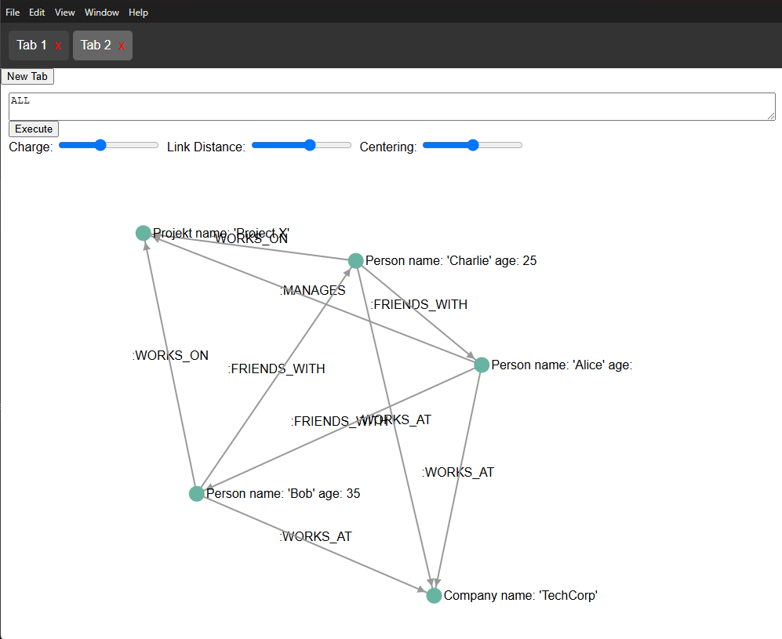
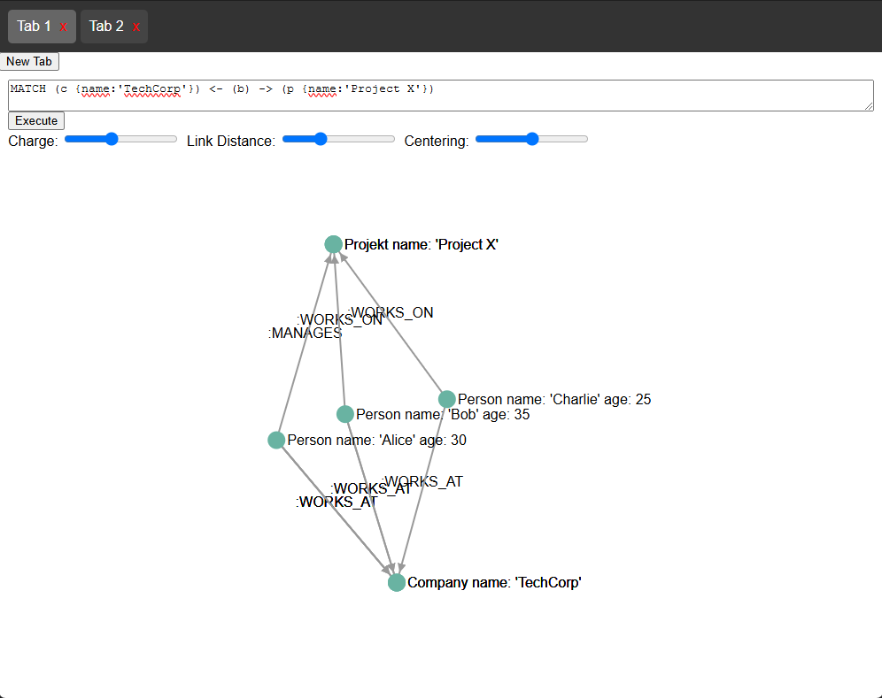

# Graph DB 
> This is a learning project on how to implement a graph database.
> The base idea here is to have a somewhat functional gql implementation

Web-Version: https://zwisler-a.github.io/graph_db/
Scripts to Try:
```
// Create a graph
INSERT
  (alice:Person {name: 'Alice', age: 30}),
  (bob:Person {name: 'Bob', age: 35}),
  (charlie:Person {name: 'Charlie', age: 25}),
  (company:Company {name: 'TechCorp'}),
  (proj:Projekt {name: 'Project X'}),
  (alice)-[:WORKS_AT]->(company),
  (bob)-[:WORKS_AT]->(company),
  (charlie)-[:WORKS_AT]->(company),
  (alice)-[:MANAGES]->(proj),
  (bob)-[:WORKS_ON]->(proj),
  (charlie)-[:WORKS_ON]->(proj),
  (alice)-[:FRIENDS_WITH]->(bob),
  (bob)-[:FRIENDS_WITH]->(charlie),
  (charlie)-[:FRIENDS_WITH]->(alice)
---------------------------
// Show complete graph (Just for debugging)
ALL
---------------------------
// Query the Graph
MATCH (c {name:'TechCorp'}) <- (b) -> (p {name:'Project X'})
---------------------------
// Insert nodes and edges 
MATCH (p:Projekt {name: "Project X"})
INSERT (eric:Person {name: 'Eric', age: 25}), 
       (fabian:Person {name: 'Fabian', age: 25}),
       (eric)-[:OWNS]->(p),
       (fabian)-[:CONSULTS]->(p)
---------------------------
// Insert edge
MATCH (eric {name:"Eric"}), (fabian {name:"Fabian"})
INSERT (eric)-[:FRIENDS_WITH]->(fabian)
---------------------------
// Delete and detach all persons
MATCH (n :Person) DETACH DELETE n
```

# Example Usage

```ts
const parser = new CypherQueryParser();
const graph = new Graph();
const graphStore = InMemoryGraphStore.from(graph);
const queryService = QueryService.from(graphStore);
const cypherQuery = `INSERT (alice:Person),(bob:Person), (alice)-[:knows]->(bob)`;
queryService.query(parser.parse(cypherQuery))
const res = queryService.query(parser.parse(`MATCH (n:Person)-[:knows]->(m)`));
console.log(JSON.stringify(res, null, 2))
```

## Getting started
`npm i && npm run ui`

---

